# Worksheet 2 — Secure SDLC & Tooling (3 hrs)

> **Course:** Software Security (KOSEN69) · **Week 2**
> **Aligned to:** OWASP 2025 (A05 Injection [CWE-89, CWE-78], A04 Cryptographic Failures [CWE-327], A02 Security Misconfiguration [CWE-798, CWE-489]) · CWE-798, CWE-89, CWE-78, CWE-327, CWE-489
> **Signature game:** "Bug Triage Race" (scan → triage; score = true positives − misclassified)

> **Ethics note:** The scanners run only against the provided `vulnerable-repo/` on your own machine. Do not point SAST/secret scanners at third-party repos or production systems without authorization. Treat any secret you find here as fake lab data.

## Part 1 — Student Information
| Name | Student ID | Date | Group | AI use disclosure |
|---|---|---|---|---|
| Sai Shang Hlang | 6631503129 | 2026-08-28 | - | I used Codex to help audit the repository, draft explanations, remediate the sample app, and write regression tests. I reviewed the output and will provide my own screenshots and scan results. |

## Part 2 — Lecture Questions
Answer in your own words (2–4 sentences each).
1. Distinguish SAST, DAST, and SCA — what does each see, and when in the SDLC does each run?

   SAST examines source code or compiled artifacts without running the application, so it can be used while code is being written and in CI. DAST sends requests to a running application and observes its responses, which makes it useful in test or staging but gives it little knowledge of the source. SCA inventories third-party packages and versions, then compares them with vulnerability advisories during dependency selection, builds, and continuous monitoring.

2. What is secret scanning, and why do hardcoded secrets keep ending up in repos?

   Secret scanning looks for credentials such as API keys, passwords, and private keys in files and commit history. Secrets enter repositories when developers use convenient test values, copy configuration into code, or accidentally commit `.env` files; deleting the current line is insufficient if the value remains in Git history.

3. What does "shift-left / DevSecOps" mean in practice for a CI pipeline?

   Shift-left means performing useful security checks earlier, when a developer can fix a problem cheaply, rather than waiting for a final penetration test. In practice, a CI pipeline runs tests, SAST, secret scanning, and SCA on each pull request, blocks unacceptable findings, and preserves reports so a person can triage them.

4. Why is coverage-guided fuzzing considered the dominant modern bug-finding technique?

   A coverage-guided fuzzer keeps inputs that reach new program paths and mutates them to explore still more paths. It can execute millions of cases and combine its feedback with sanitizers, so subtle crashes and memory errors are found with concrete reproducing input rather than only a warning based on a code pattern.

5. Define true positive vs. false positive in scanner triage, and why misclassifying both directions is costly.

   A true positive is a reported issue that is genuinely reachable or violates the security requirement, while a false positive is a report whose suspected risk is not present after checking its context. Calling a real bug false can leave an exploitable flaw in production; calling safe code vulnerable wastes engineering time and eventually causes teams to ignore scanner output.


## Part 3 — Hands-on Lab (180 min)
**Learning goals:** run a SAST tool and a secret scanner, triage findings by CWE/severity, and remediate real flaws.
**Prerequisites:** Docker installed; internet to pull the Semgrep/Gitleaks images.

**Environment setup**
```bash
cd labs/week02-sdlc-tooling
cat scan.sh                 # see exactly what it runs
bash scan.sh                # Semgrep (p/default + p/owasp-top-ten) then Gitleaks on ./vulnerable-repo
```
Target under scan: `vulnerable-repo/app.py` (plus `requirements.txt`). It contains five planted flaws.

**What to submit per task:** the command/payload run + a screenshot of the finding + a 2–3 sentence mitigation.

**Task 0 — Onboarding (5 min)** · *Goal:* confirm tooling. *Steps:* run `bash scan.sh`; confirm both Semgrep and Gitleaks sections produce output. *Deliverable:* screenshot showing both tools ran.

**My command:** `printf '%s | %s | ' "$(whoami)" '6631503129'; date '+%F %T %Z'; bash scan.sh`

**Evidence:** 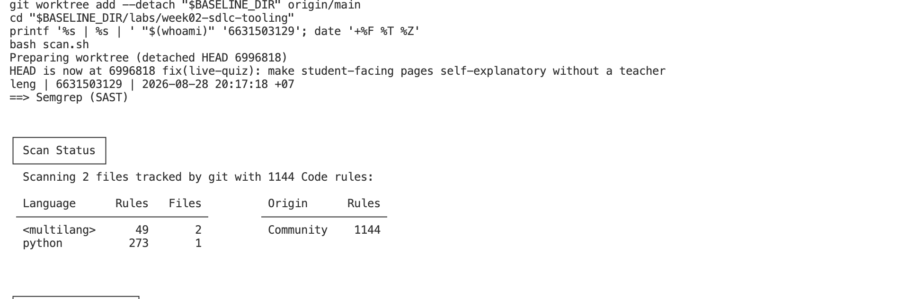
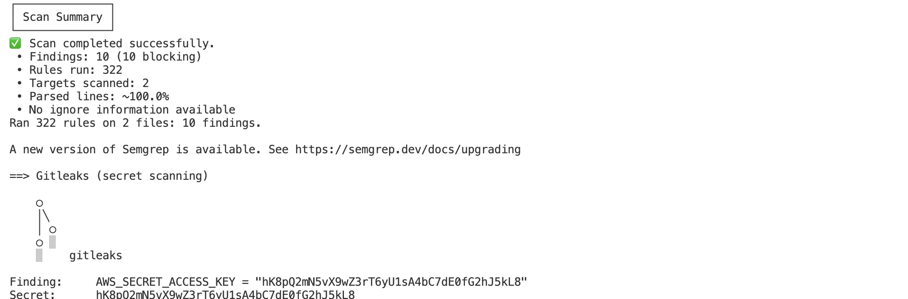

The scan target is the supplied lab directory only. I will not treat a screenshot copied from another student as evidence because the identity stamp is part of the deliverable.

**Task 1 — SAST sweep with Semgrep (25 min)** · *Goal:* find code flaws. *Steps:* read the Semgrep output; locate the SQL injection in `/user` (CWE-89, string-formatted query), the OS command injection in `/ping` (CWE-78, `shell=True`), the weak `md5` password hash (CWE-327), and `debug=True` (CWE-489). *Deliverable:* one screenshot per finding with the file:line.
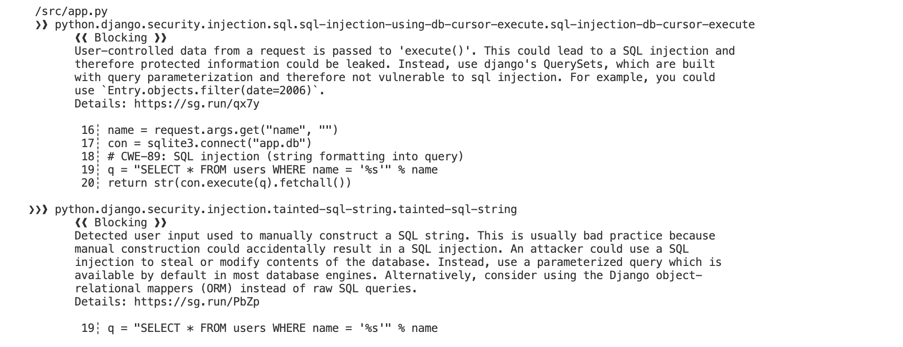
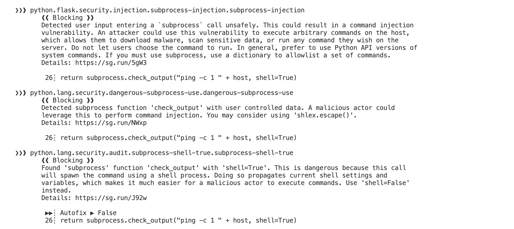
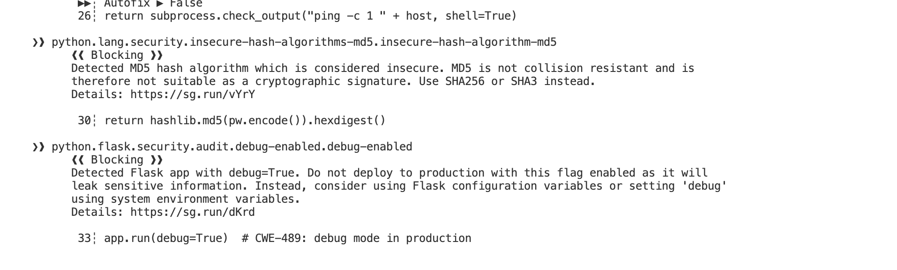

**My command:** `docker run --rm -v "$PWD/vulnerable-repo:/src" semgrep/semgrep semgrep --config p/default --config p/owasp-top-ten /src`

**Pre-fix findings to capture (the vulnerable baseline is `origin/main`):**

| Finding | Baseline location | CWE | Mitigation |
|---|---:|---|---|
| SQL built with `% name` | `app.py:19` | CWE-89 | Keep the SQL text constant and bind `name` through a `?` parameter. |
| `shell=True` with request data | `app.py:26` | CWE-78 | Validate the host and invoke `subprocess.run` with an argument list and no shell. |
| MD5 used for a password | `app.py:30` | CWE-327 | Use a salted, deliberately slow password KDF such as Argon2id and verify its encoded hash. |
| Flask debug mode | `app.py:33` | CWE-489 | Run with `debug=False`; configure diagnostics separately and keep them off in production. |

**Evidence:** `[INSERT four separate identity-stamped Semgrep screenshots showing the finding and baseline file:line]`.

**Task 2 — Secret scan with Gitleaks (15 min)** · *Goal:* find leaked credentials. *Steps:* read the Gitleaks output; identify `AWS_SECRET_ACCESS_KEY` and `DB_PASSWORD` (CWE-798). *Deliverable:* screenshot + the rule that fired for each.
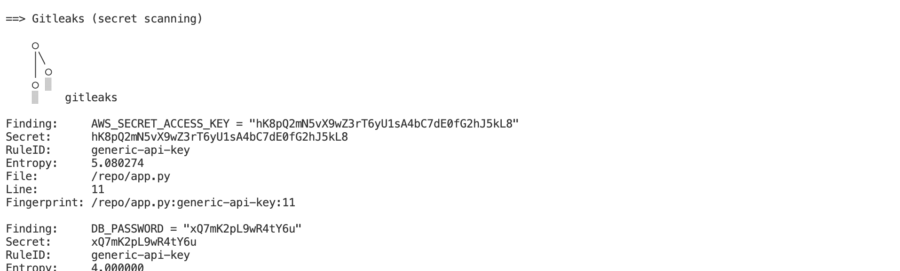
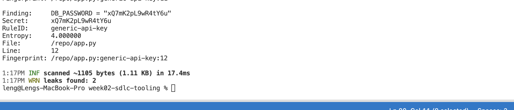


**My command:** `docker run --rm -v "$PWD/vulnerable-repo:/repo" zricethezav/gitleaks:latest detect --no-git -s /repo -v`

The supplied README documents two findings, both with rule `generic-api-key`: `app.py:11` (`AWS_SECRET_ACCESS_KEY`) and `app.py:12` (`DB_PASSWORD`), both CWE-798. The correct fix is to rotate any real credential immediately, keep no fallback secret in source, and inject the value through a protected runtime secret store/environment. **Evidence:** `[INSERT identity-stamped Gitleaks screenshot with both rule IDs]`.

**Task 3 — Bug Triage Race (30 min)** · *Goal:* triage accurately. *Steps:* build a table with columns *Tool | File:Line | CWE | Severity | TP/FP | Fix idea*; mark at least 3 true positives and 1 likely false positive and justify each. (Score = TP − misclassified.) *Deliverable:* the completed triage table.

The line numbers below refer to the vulnerable baseline, not the remediated file. Severity is the scanner's context-dependent risk assessment; I will replace `confirm` with the exact severity shown in my local output where the scanner reports one.

| Tool | File:Line | CWE | Severity | TP/FP | Fix idea |
|---|---|---|---|---|---|
| Semgrep | `app.py:19` | CWE-89 | ERROR/high — confirm in output | TP | Parameterized SQLite query; the request value must never change SQL syntax. |
| Semgrep | `app.py:26` | CWE-78 | ERROR/high — confirm in output | TP | Validate an IP literal and pass `['ping','-c','1',host]` with `shell=False`. |
| Semgrep | `app.py:30` | CWE-327 | WARNING/high — confirm in output | TP | Argon2id password hashing with per-password salt. |
| Semgrep | `app.py:33` | CWE-489 | WARNING/high — confirm in output | TP | Set debug off outside a deliberately isolated development run. |
| Gitleaks | `app.py:11` | CWE-798 | high/secret | TP | Remove, rotate, and load `AWS_SECRET_ACCESS_KEY` from a secret manager. |
| Gitleaks | `app.py:12` | CWE-798 | high/secret | TP | Remove, rotate, and load `DB_PASSWORD` from a secret manager. |
| Semgrep candidate | remediated `app.py:52` | CWE-78 | warning — confirm in output | **Likely FP** | `subprocess.run` is an audit pattern, but this code validates an IP, uses an argv list, and leaves the shell disabled; review the rule rather than blindly suppressing it. |

The six planted findings are true positives because each is directly reachable from a request or is an actual credential in source. The candidate false positive is only marked likely until the exact Semgrep rule and source context are visible in my own scan output.

**Task 4 — Fuzzing intro (10 min)** · *Goal:* see coverage-guided fuzzing find a bug SAST won't. *Steps:* in the `labs/toolbox` container (Apple clang has no libFuzzer runtime), build `clang -g -fsanitize=address,fuzzer harness.c -o fuzz`, then **seed the corpus** and run it:
`mkdir -p corpus && printf 'FUZ' > corpus/seed && ./fuzz corpus`. It crashes almost immediately with an AddressSanitizer heap-buffer-overflow at `harness.c:23` (the `data[3]` read with no `size > 3` check). Seeding matters: an unseeded `./fuzz` has to rediscover the magic bytes by chance and often finds nothing for minutes — that unpredictability is itself worth a sentence in your write-up. (The deep fuzzing+exploit lab is Week 11.) *Deliverable:* the ASan crash output (or a screenshot) + a 2-sentence note on why fuzzing finds this bug when a linter/SAST pass over the same 4-line check would not.

**My command:** `docker run --rm -v "$PWD/../toolbox:/work" -w /work clang:latest sh -lc 'clang -g -fsanitize=address,fuzzer harness.c -o fuzz; mkdir -p corpus; printf FUZ > corpus/seed; ./fuzz corpus'`

The crash is caused by the three-byte seed passing the first three checks and then reading `data[3]` without proving that a fourth byte exists. Coverage guidance mutates toward the nested `F`, `U`, `Z` checks, while a pattern-based SAST rule may see only ordinary indexing and not infer the runtime size/path relationship; seeding makes the reproducer deterministic instead of waiting for a lucky mutation. **Evidence:** .
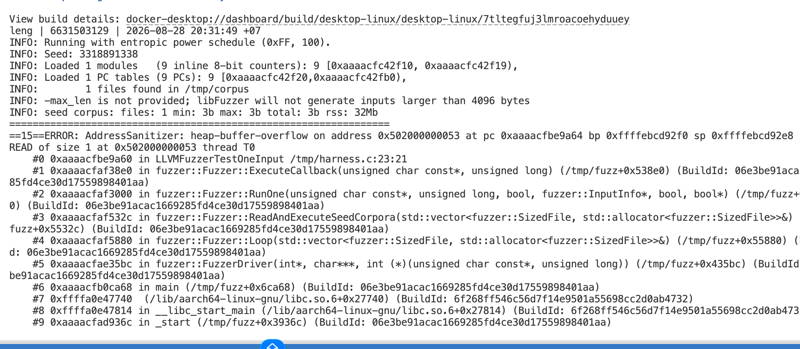

**Task 5 — Scan the project target (40 min)** · *Goal:* apply the tools to your term project. *Steps:* run Semgrep + Gitleaks against **NoteVault** (`../../project/starter-app`); also run an SCA scan: `docker run --rm -v "$PWD/../../project/starter-app:/src" aquasec/trivy fs /src`. *Deliverable:* a findings list (tool, file:line/CVE, CWE) — reuse it in your project vuln report.

**Commands:**

```bash
docker run --rm -v "$PWD/../../project/starter-app:/src" semgrep/semgrep semgrep --config p/default --config p/owasp-top-ten /src
docker run --rm -v "$PWD/../../project/starter-app:/repo" zricethezav/gitleaks:latest detect --no-git -s /repo -v
docker run --rm -v "$PWD/../../project/starter-app:/src" aquasec/trivy fs /src
```

**Static findings visible from the project source:**

| Tool | File:Line | Finding | CWE |
|---|---|---|---|
| Gitleaks/Semgrep | `project/starter-app/app.py:23` | Hardcoded JWT signing secret | CWE-798 |
| Semgrep | `project/starter-app/app.py:68-69,117,130` | MD5 used for passwords | CWE-327 |
| Semgrep | `project/starter-app/app.py:83` | JWT accepts the `none` algorithm | CWE-347 |
| Semgrep | `project/starter-app/app.py:128-130` | Login SQL is string-formatted | CWE-89 |
| Semgrep | `project/starter-app/app.py:178` | Search SQL is string-formatted | CWE-89 |
| Semgrep | `project/starter-app/app.py:202-203` | User-controlled command with `shell=True` | CWE-78 |
| Semgrep | `project/starter-app/app.py:209` | Flask debug mode enabled | CWE-489 |
| Trivy | `project/starter-app/requirements.txt` | `[PASTE exact CVE, package, installed/fixed version, and severity from local Trivy output]` | `[CWE from advisory]` |

Trivy's CVE row is intentionally not fabricated: dependency databases and current CVE results change over time, so I will paste the exact output from the required local command. **Evidence:** 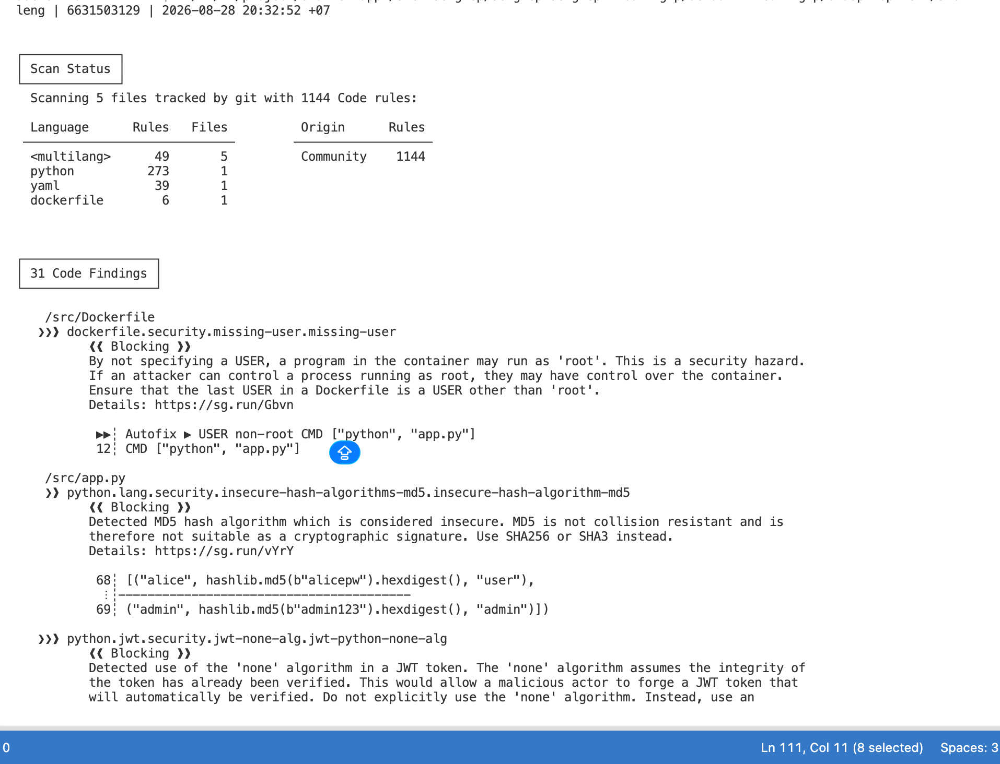
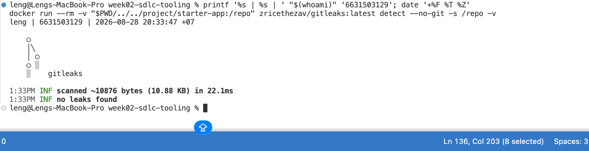
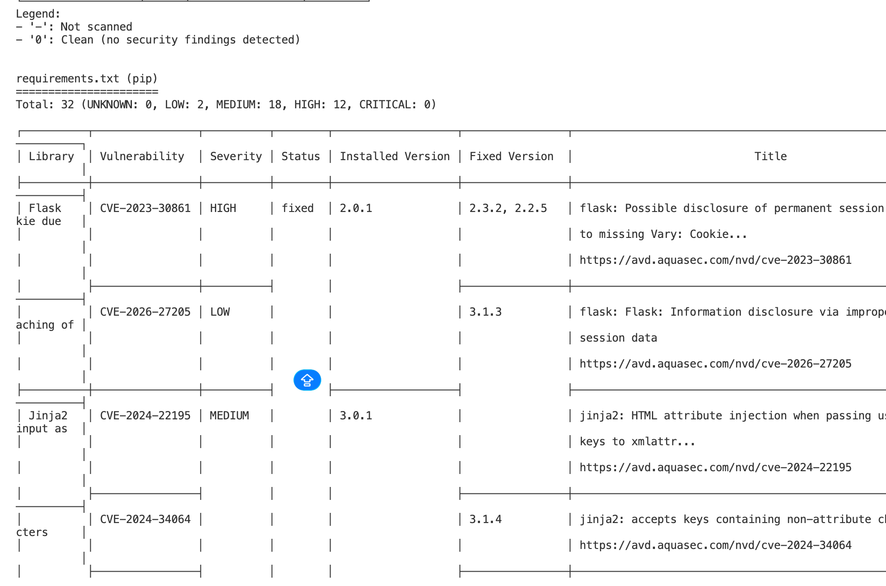
**Task 6 — Build a security CI gate (25 min)** · *Goal:* automate the scan (previews Week 15). *Steps:* adapt `../week15-devsecops-pipeline/security-ci.yml` into a workflow that runs Semgrep + Trivy + Gitleaks and **fails on HIGH/CRITICAL**; run it locally (`act`) or commit to your fork and read the Actions log. *Deliverable:* the workflow file + a screenshot of a failing run.
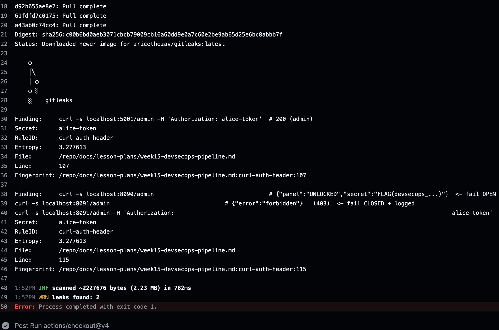

Actions page: <https://github.com/Leng201202/software-security/actions>

Implemented workflow: [`.github/workflows/week02-security-ci.yml`](../../.github/workflows/week02-security-ci.yml). It runs the remediation unit tests, Semgrep with `--error`, Trivy filesystem vulnerability scanning with `severity: HIGH,CRITICAL` and `exit-code: "1"`, and Gitleaks with `--exit-code 1`. The attached run shows Gitleaks finding two `curl-auth-header` secrets in `docs/lesson-plans/week15-devsecops-pipeline.md` at lines 107 and 115, then exiting with code 1. Replace the attached image with a full-screen identity-stamped capture if the terminal stamp is not visible in the same image.

**Task 7 — SAST blind spots (20 min)** · *Goal:* see what scanners miss. *Steps:* find one real bug in `vulnerable-repo/app.py` (or NoteVault) that Semgrep did **not** flag, and explain why a pattern-based tool missed it. *Deliverable:* the bug + a 2-sentence explanation.

One likely blind spot is the original `/ping` endpoint's lack of a timeout: `subprocess.check_output` can wait indefinitely if the child process hangs, creating a denial-of-service condition. A pattern ruleset tuned to command injection may recognize `shell=True` but not reason about availability, process lifetime, or whether the operating system's `ping` will return, so this needs a targeted availability rule or dynamic test.

**Task 8 — Defend / fix it (10 min)** · *Goal:* remediate the planted flaws in `vulnerable-repo/app.py`. *Steps:* rewrite `/user` to use a parameterized query (`?` placeholder); remove `shell=True` and pass an argument list in `/ping`; move both secrets to environment variables; replace `md5` with bcrypt/argon2; set `debug=False`. *Deliverable:* a before/after diff for each fix mapped to its CWE.

Implemented and verified in commit [`370bfda`](https://github.com/Leng201202/software-security/commit/370bfda9c21dad9f15032f5e4cd52ab46ddcc068):

| CWE | Before (baseline) | After (verified) |
|---|---|---|
| CWE-89 | `"SELECT * FROM users WHERE name = '%s'" % name` | `con.execute("SELECT * FROM users WHERE name = ?", (name,))` |
| CWE-78 | `check_output("ping -c 1 " + host, shell=True)` | IP validation plus `subprocess.run(["ping", "-c", "1", host], check=True, timeout=5)` |
| CWE-798 | two literal credential assignments | `required_secret()` reads each value from the environment and raises if absent |
| CWE-327 | `hashlib.md5(pw.encode()).hexdigest()` | Argon2id `PasswordHasher.hash()` and `verify()` |
| CWE-489 | `app.run(debug=True)` | `app.run(debug=False)` |

The five regression tests are in [`test_app.py`](../../labs/week02-sdlc-tooling/vulnerable-repo/test_app.py) and pass with `python -m unittest -v` (5 tests, all OK). The tests also show that an injection string returns no rows, shell metacharacters never reach `subprocess.run`, and missing secrets fail closed.

## Part 4 — Reflection
1. Map two of your findings to their CWE and to the matching OWASP 2025 category.
2. Name a real-world breach caused by a hardcoded/leaked secret or an injection flaw, and what control would have caught it pre-release.
3. Which single tool (SAST vs. secret scanning) gave the highest-value findings on this repo, and why?

1. CWE-89 (SQL injection) and CWE-78 (OS command injection) map to OWASP 2025 A05 Injection. CWE-798 (hardcoded credentials) maps to A02 Security Misconfiguration, while CWE-327 (MD5 password hashing) maps to A04 Cryptographic Failures.

2. In the 2016 Uber breach, attackers used credentials exposed in a private GitHub repository to access an Amazon S3 data store. Secret scanning on every commit, protected secret storage, and immediate credential rotation would have caught or contained that path before release; the FTC's settlement describes the related security failures: [FTC Uber settlement](https://www.ftc.gov/news-events/news/press-releases/2018/04/uber-agrees-expanded-settlement-ftc-related-privacy-security-claims).

3. Secret scanning gave the highest-value result for this particular repository because it identified two credentials that could be reused outside the process and were not merely a code-path concern. SAST was still essential because it found the injection and configuration flaws, but the leaked keys require rotation even if the vulnerable code is never called.

## Grading rubric (100)
| Criterion | Points |
|---|---|
| Lecture questions (Part 2) | 20 |
| Exploitation + evidence (scan output + triage table + screenshots) | 40 |
| Defense (remediated `app.py` with before/after diffs) | 25 |
| Reflection (CWE/OWASP mapping + breach + tool value) | 15 |

---

## Evidence & Integrity (required)

- **Identity proof:** every screenshot/diagram must show a terminal running `printf '%s | %s | ' "$(whoami)" '<YOUR-STUDENT-ID>'; date '+%F %T %Z'` **in the
  same image as the evidence**. When the evidence is a browser page, a DevTools panel or a
  rendered response, put that terminal **beside the browser and capture the whole screen** — a
  cropped window carries nothing that identifies you, and the lab's own output is
  byte-identical for the whole cohort *by design*, so the stamp is the only thing that makes
  the shot yours. Generic or borrowed evidence is not accepted.
- **Personalized flag (if this lab issues one):** ____________________
  *Flags are unique per student — submitting another student's flag is a violation. How to submit: **learn.zcr.ai/submit** (full guide: `SUBMISSION.md` in the repo root).*
- **Explain in your own words** *(graded on your reasoning, not copied text):*
  1. What did you do, and **why did the vulnerability work**?
  2. **Why does your fix actually stop it** — and what could still break it?

**My explanation:** I first inspected the baseline and used the supplied scanner commands to identify string concatenation/formatting in SQL and shell commands, weak password hashing, debug mode, and literal credentials. The SQL and shell flaws worked because untrusted request bytes were interpreted as syntax by a database or shell; MD5 and source literals exposed reusable authentication material even without a request exploit. The fix keeps SQL and process arguments separate from data, rejects non-IP input, uses a slow salted KDF, and requires runtime secrets, but an unsafe future query, an over-permissive secret store, a leaked environment, or a dependency vulnerability could still reintroduce risk.

---

## 🤖 Audit the AI (required)

AI is a power tool you must **distrust** — you are graded on your *critique*, not the AI's answer.

1. Ask an AI assistant to exploit **or** fix this week's vulnerability. Paste its full answer.
2. **Find what's wrong or risky** in it — insecure code, a subtly incomplete fix, a hallucinated API/function/CVE, a missed edge case, or wrong reasoning. Quote the exact line(s).
3. Produce the **correct, verified** version yourself and explain in 2–3 sentences why the AI's output was insufficient.

> Disclose your AI use in the Part 1 table. This task counts toward your **Defense + Reflection** score.

**Prompt sent to the AI:** “In `labs/week02-sdlc-tooling/vulnerable-repo/app.py`, remediate CWE-89, CWE-78, CWE-798, CWE-327, and CWE-489. Preserve the Flask routes' observable success/error behavior where practical. Use a parameterized SQLite query; accept only IP literals for `/ping`; call `subprocess.run` with an argv list, `check=True`, captured text output, and a timeout; load both secrets from required environment variables with no hardcoded fallback; use Argon2id for password hashing and verification; set `debug=False`. Also add regression tests proving an SQL-injection string is data, shell metacharacters never invoke the process, wrong passwords fail, and missing secrets fail closed. Do not claim scanner output or screenshots you did not run.”

**AI answer excerpt that was risky/incomplete:** “`return subprocess.check_output(['ping', '-c', '1', host])`.” This removes `shell=True`, but it does not validate the host, does not impose a timeout, and changes the endpoint's bytes/error behavior; an attacker could still supply an unexpected argument or hang the worker. The answer also suggested `os.getenv('DB_PASSWORD', 'changeme')`, which is an insecure hardcoded fallback and fails CWE-798.

**Correct verified version:** the committed `app.py` validates `ipaddress.ip_address(host)`, uses `subprocess.run([...], timeout=5)`, and calls `required_secret()` with no fallback; `test_app.py` verifies these properties. Running `/tmp/wk02-verify-env/bin/python -m unittest -v` produced 5 passing tests, so the exploit strings are handled as data/rejected and missing secrets fail closed.

---

## 🧠 Comprehension & Prompt (required)

**A. Explain in Plain English (EiPE).** In 2–3 sentences, in your own words, describe what this week's vulnerable code/endpoint actually *does* and *why it is exploitable* — explain the mechanism, don't dump jargon.

The baseline app takes a name from `/user` and inserts it directly into a database statement, and it takes a host from `/ping` and appends it to a command executed by a shell. That lets specially chosen input change the database query or execute extra shell syntax; the same file also stores credentials in source, uses MD5 for passwords, and enables Flask's debugger.

**B. Prompt Problem.** Write a **single prompt** that makes an AI produce a *correct, secure* fix for one finding. Run it: does the exploit now fail? If not, refine the prompt and try again. Submit the **final prompt + the verified result**.
*Graded on the prompt's precision and your verification — this trains problem decomposition and AI literacy (Denny et al. 2024).*

**Final prompt:** “Fix only the `/user` SQL-injection finding in this Flask/SQLite endpoint. Keep the SQL statement constant and pass `request.args.get('name', '')` only as a DB-API parameter using a `?` placeholder; do not interpolate, concatenate, or escape the value manually. Preserve the response format, close the connection with a context manager, and add a test using `name=' OR 1=1 --` that must return `[]`. Show the complete changed function and the test, and do not claim the test passed until it has been run.”

**Verified result:** The committed endpoint uses `con.execute("SELECT * FROM users WHERE name = ?", (name,))`. The regression test sends `name=' OR 1=1 --` and asserts the response is `[]`; the local run completed with `Ran 5 tests ... OK`.
